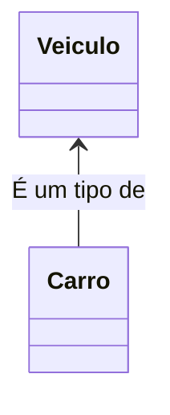
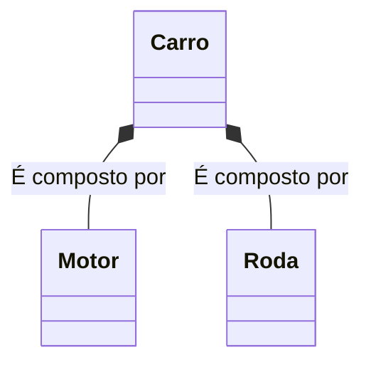
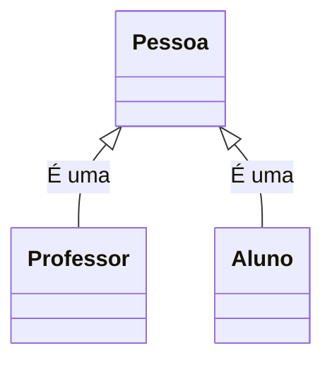
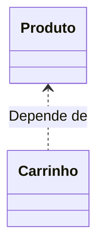
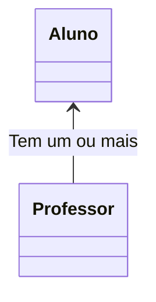
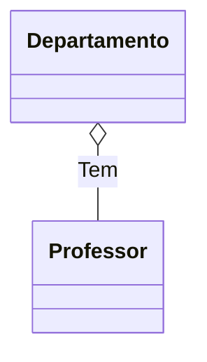
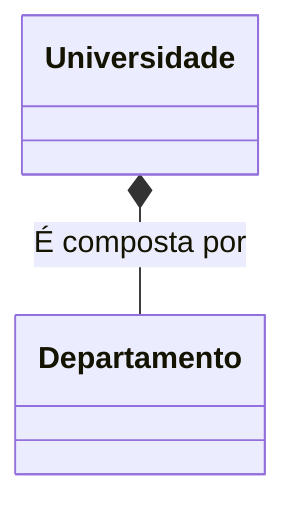
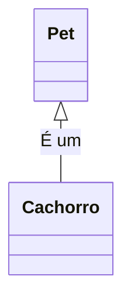
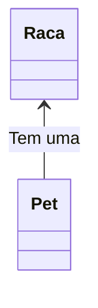
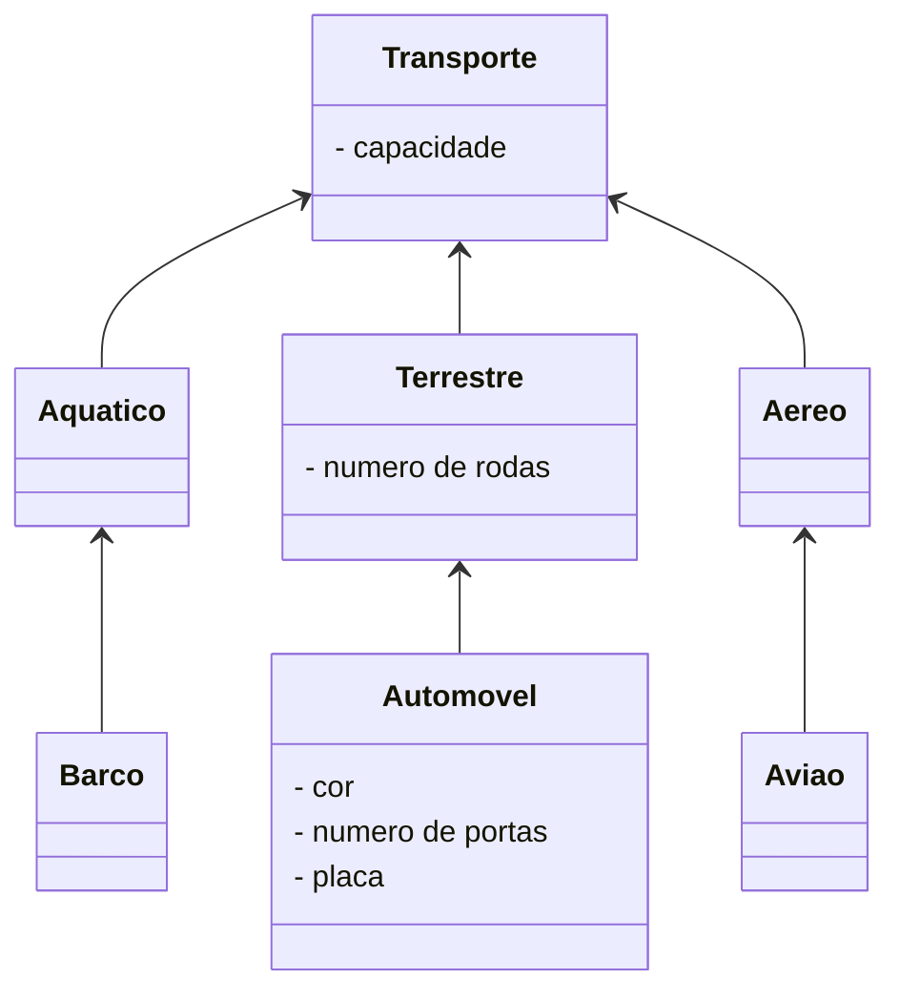

<h1>Programação Orientada a Objetos - Parte 02</h1>

As informações passadas neste documento norteia os conceitos da Oracle e podemos encontrar através deste link:

<div align="left"><a href="https://docs.oracle.com/javase/8/docs/api/">Oracle</a></div>

Anteriormente, iniciamos nossos estudos sobre os conceitos iniciais da Programação Orientada a Objetos, tais como **Classes, Objetos, Métodos, Atributos e Encapsulamento**. Neste material veremos outros 2 conceitos fundamentais: **Herança e Polimorfismo**. Antes, vamos entender o que é Relacionamento entre Classes:

<h2>1. Relacionamento entre Classes</h2>

**Os Relacionamentos entre classes no Java** definem os Relacionamentos especiais entre os diferentes tipos de classes.

No exemplo abaixo, existe uma relação especial entre uma classe chamada Veículo e uma classe chamada Carro: Um Carro é um tipo de Veículo, como mostra a figura abaixo:



No próximo exemplo, também existe um tipo diferente de relacionamento entre as classes Carro, Motor e Roda. Um Carro é compostos por Motor e Roda, como mostra a figura abaixo:



Quando projetamos um aplicativo, precisamos explorar os tipos de relacionamentos entre as classes, porque os relacionamentos nos ajudam de várias maneiras.

Por exemplo, suponha que em um aplicativo, temos classes com comportamentos comuns (métodos), então podemos economizar esforço colocando os comportamentos comuns (métodos) dentro da superclasse.

Suponha que algumas classes não estejam relacionadas entre si, então podemos atribuir diferentes programadores para implementar cada uma delas, sem nos preocuparmos que uma delas terá que esperar pela outra. Os relacionamentos entre as classes ajudam a entender como os objetos em um programa trabalham em conjunto e se comunicam entre si.

<h3>1.1. Tipos de relacionamento entre classes em Java</h3>

Existem três relacionamentos mais comuns entre classes em Java que são os seguintes:

- Herança ("Is-A")
- Dependência (“Usos-A”)
- Associação (“Has-A”)

A associação é ainda classificada em agregação e composição, como vemos no Organograma abaixo:

<div align="center"></div>


<h4>1.1.1. Relação de Herança</h4>

A herança estabelece um relacionamento entre uma classe mais genérica e abstrata (conhecida como superclasse) e uma classe mais especializada (conhecida como subclasse).

Em outras palavras, define o relacionamento entre duas classes em que uma classe estende outra classe, ou simplesmente um Relacionamento do tipo É-Um (Is-A).



<h4>1.1.2. Relação de Dependência</h4>

Quando criamos um objeto de uma classe dentro de um método de outra classe, esse relacionamento é chamado **de relacionamento de dependência em Java** , ou simplesmente relacionamento Usa-A (Uses-A).

Em outras palavras, quando um método de uma classe usa um objeto de outra classe, ele é chamado de dependência em java. É o relacionamento mais óbvio e mais geral em java.



No Diagrama acima, em um aplicativo de comércio eletrônico, a classe Carrinho depende da classe Produto porque a classe Carrinho usa a classe Produto como parâmetro para uma operação de adição de itens. 

Esse tipo de Relacionamento deve ser evitado devido ao alto grau de acoplamento gerado pela dependência.

<h4>1.1.3. Relacionamento de Associação</h4>

A associação é outro relacionamento fundamental entre classes que é informalmente conhecido como relacionamento “**Tem-Um**” (Has-A).

Quando um objeto de uma classe é criado como membro de dados dentro de outra classe, ele é chamado **de relacionamento de associação em java** ou simplesmente um Relacionamento do tipo Tem-Um.



Existem dois tipos de relacionamento de Associação especiais, que são os seguintes:

- Agregação
- Composição

**Agregação :** A agregação é um dos conceitos centrais da programação orientada a objetos. Ele se concentra em estabelecer um relacionamento Tem-A entre duas classes.

Em outras palavras, dois objetos agregados têm seu próprio ciclo de vida, mas um dos objetos tem um proprietário do relacionamento Tem-A e o objeto filho não pode pertencer a outro objeto pai.



No exemplo acima, um Objeto Departamento contém diversos Objetos Professor e  os Objetos Professor continuam existindo mesmo sem o Objeto  Departamento.

**Composição :** A composição é outro dos conceitos centrais da programação orientada a objetos. Ele se concentra em estabelecer uma forte relação Tem-A entre as duas classes.

Em outras palavras, dois objetos compostos não podem ter seu próprio ciclo de vida. Ou seja, um objeto composto não pode existir por conta própria. Se um objeto composto for destruído, todas as suas partes também serão excluídas. Veja o exemplo abaixo:



Por exemplo, uma Universidade pode ter vários Departamentos. Um Departamento não pode existir independentemente sem a existência da Universidade e nenhum Departamento pode pertencer a duas Universidades diferentes. Se a Universidade for destruída, todos os seus Departamentos serão destruídos automaticamente.

<h3>Como decidir que tipo de relacionamento precisamos?</h3>

Os relacionamentos mais importantes são o relacionamento É-Um (Herança) e o relacionamento Tem-Um (Associação). A melhor maneira de decidir que tipo de relacionamento devemos criar é a seguinte:

1. Se o seu problema for definido com a frase: "*O Objeto A é um tipo do Objeto B*", então você deve usar o relacionamento de Herança. **Exemplo:** "*Um cachorro é um Pet*". Não podemos dizer “*Um Cachorro tem um Pet*”, pois não faz o menor sentido. Então, neste caso, vamos criar uma superclasse chamada Pet e uma subclasse derivada chamada Cachorro.



2. Por outro lado, se o seu problema for definido com a frase: "*O Objeto A tem um Objeto B*", então você deve usar o relacionamento Has-A (Associação). **Exemplo:**  “*Um Pet tem uma Raça*”. Não podemos dizer: “*Um Pet é uma Raça*”. Esta afirmação não faz o menor sentido. Então, neste caso, vamos criar uma associação entre a Classe chamada Pet e a Classe derivada chamada Cachorro.



|  | <p align="justify"> **IMPORTANTE:** Neste primeiro momento, iremos focar na Relação de Herança. </p> |
| ------------------------------------------------------------ | ------------------------------------------------------------ |

<br />

<h2>2. Herança</h2>

O que torna a Orientação a Objetos única é o **conceito de herança**. **Herança** é um mecanismo que permite que características comuns a diversas classes sejam fatoradas de uma classe base, ou **superclasse**, ou seja, permite uma Classe herdar todos os Atributos e Métodos de outra Classe. 

<div align="center"></div>

Analisando a imagem acima: 

- Considere **capacidade** como um atributo da **Classe Transporte**, que indica a quantidade de pessoas que o transporte em questão pode transportar.
- O atributo **numero de rodas** como um atributo da **Classe Terrestre**.
- Os atributos **cor, número de portas e placa** como atributos da **Classe Automóvel**.
- A imagem acima apresenta um exemplo de Herança, onde:
  - As **Classes Aquático, Terrestre e Aéreo** herdam a **Classe Transporte**.
  - A **Classe Barco** herda a **Classe Aquático**.
  - A **Classe Automóvel** herda a **Classe Terrestre**.
  - A **Classe Avião** herda a **Classe Aéreo**.

A herança é uma forma de reutilização de software em que novas classes são criadas a partir das classes existentes, absorvendo todos os seus atributos e métodos, além de adicionar novos recursos que as novas classes exigem. A partir de uma **classe base**, outras classes podem ser especificadas e cada classe derivada ou **subclasse** apresenta as características (estrutura e métodos) da **superclasse**, além de acrescentar o que for definido como particularidade da subclasse. Cada **subclasse** também se torna uma candidata a ser uma **superclasse** para alguma subclasse futura

Observando o exemplo acima:

- A **Classe Transporte** possui um **atributo chamado capacidade**.
- Como a **Classe Aquático** herda a **Classe Transporte**, pode-se dizer que ela também possui o **atributo capacidade**.
- A **Classe Barco**, como herda a **Classe Aquático**, também possui o **atributo capacidade**.

Abaixo, vemos o Diagrama de Classes do exemplo acima:



<h3>2.1. Tipos de Herança</h3>

Existem basicamente 2 tipos de herança:

- **Herança Simples:** Cada classe pode ter apenas uma superclasse. Na linguagem Java usa-se a palavra reservada **extends** para declarar que uma classe é herdeira de outra.
- **Herança Múltipla:** É a capacidade de uma classe possuir mais de uma superclasse e herdar os atributos e métodos
  de todas as superclasses. Java não implementa Herança Múltipla nativamente, como a Linguagem C++, por exemplo. Para simular a herança múltipla em Java, usa-se **Interfaces**, que veremos mais adiante.

<h3>2.2. Herança em Java</h3>

<div align="center"></div>

**Modificador de Acesso:** 

Determina como a Classe será manipulada no decorrer do desenvolvimento do programa, ou seja, a acessibilidade da Classe. Na tabela abaixo temos os Modificadores de visibildade:

Independentemente do moderador escolhido, um método pode ser chamado, a partir de qualquer outro método contido na mesma classe.

| **Modificador**            | **Descrição**                                                |
| -------------------------- | :----------------------------------------------------------- |
| **friendly<br />(Padrão)** | Uma  classe definida como friendly somente poderá ser acessada por objetos do mesmo pacote. |
| **public**                 | Uma  classe definida como pública poderá ser acessada por qualquer objeto em qualquer pacote. Uma  classe pública deve ser única no arquivo em que está declarada e o nome do arquivo deve ser igual ao da classe. |
| **final**                  | Uma  classe final pode ser instanciada, mas não pode ser derivada, isto é, não  pode ser superclasse de nenhuma subclasse. |
| **abstract**               | Classes  abstratas são aquelas que contém ao menos um método incompleto. Desse modo  uma classe abstrata não pode ser instanciada, mas pode ser derivada. Neste caso, a subclasse deve prover o corpo do método para que possa ser instanciada. |

A palavra reservada **extends** - indica que está sendo criada uma nova classe que deriva de uma classe existente

A **Classe existente** é a superclasse, classe base ou classe progenitora.

A **Nova classe** é a subclasse, classe derivada ou classe filha.

<h2>3. Criando a Classe Conta Corrente herdando a Classe Conta</h2>

Veja abaixo a implementação da Classe Conta Corrente herdando a Classe Conta:

```java
public class ContaCorrente extends Conta{

	private float limite;

	public ContaCorrente(int numero, int agencia, int tipo, String titular, float saldo, float limite) {
		super(numero, agencia, tipo, titular, saldo);
		this.limite = limite;
	}
	
	public float getLimite() {
		return limite;
	}

	public void setLimite(float limite) {
		this.limite = limite;
	}

	@Override
	public boolean sacar(float valor) { 
		
		if(this.getSaldo() + this.getLimite() < valor) {
			System.out.println("\n Saldo Insuficiente!");
			return false;
		}
		
		this.setSaldo(this.getSaldo() - valor);
		return true;
		
	}
	
	public void visualizar() {
		super.visualizar();
		System.out.println("Limite de Crédito: " + this.limite);
	}
    
}
```

A palavra-chave **super** refere-se a uma **SuperClasse**. Ela indica a chamada ao Método Construtor da **superclasse**. Caso a **superclasse** não possua um Método Construtor e o Método Construtor da **subclasse** não chamar nenhum outro Método Construtor da **superclasse** explicitamente o compilador java vai informar um erro.

Observe que na **Classe ContaCorrente** foram declaradas apenas **as diferenças (Métodos e Atributos)** entre a **subclasse** e **superclasse**, ou seja, o reuso é automático.

<h2>4. Sobrescrita de Métodos</h2>

O ato de sobrescrever um método ou propriedade significa dar uma nova forma ao mesmo, uma nova versão. Em Java, a  **sobrescrita** de **métodos** seria criar um novo **método** na classe filha contendo a mesma assinatura e mesmo tipo de retorno do **método** sobrescrito. (Override). 

Não confundir com a **sobrecarga** de Método, que no caso seria, o que permite **métodos** de mesmo nome, mas com suas assinaturas diferentes, coexistirem em uma mesma Classe.

A **sobrescrita** (ou override) está diretamente relacionada à orientação a objetos, mais especificamente com a herança. Com a **sobrescrita**, conseguimos especializar os **métodos** herdados das superclasses, alterando o seu comportamento nas subclasses por um mais específico.

Para indicar que um Método foi sobrescrito, utilizamos a anotação **@Override**.

> **Anotação:** Anotações são metadados que podem ser inseridos diretamente no código, para  “configurar” determinados recursos que antes deveriam ser feitos em  arquivos separados como, por exemplo, no XML. 
>
> **Metadados:** Metadados, ou Metainformação, são dados sobre outros dados. Um  item de um metadado pode dizer do que se trata aquele dado, geralmente  uma informação inteligível por um computador. Os metadados facilitam o  entendimento dos relacionamentos e a utilidade das informações dos  dados.

Veja no exemplo abaixo, o Método sacar da Classe Conta e o Método sacar da Classe Conta Corrente:

```Java
	// Método Sacar - Classe Conta
	public void sacar(float valor) {
		if (this.getSaldo() < valor)
			System.out.println("\n Saldo Insuficiente!");

		this.setSaldo(this.getSaldo() - valor);
	}

	// Método Sacar - Classe Conta Corrente
	@Override
	public void sacar(float valor) {

		if(this.getSaldo() + this.getLimite() < valor)
			System.out.println("\n Saldo Insuficiente!");
		
		this.setSaldo(this.getSaldo() - valor);
	}
```

Observe que as assinaturas dos Métodos são as mesmas, entretanto o **Método Sacar da Classe ContaCorrente**, além de de estar anotado com a anotação **@Override**, ele também possui uma implementação diferente, porquê uma conta corrente possui um limite de crédito que as outras contas não possuem, logo o Método foi sobrescrito porquê caso contrário o saque poderia ser bloqueado por motivo de saldo insuficiente.

Lembre-se que para que o Método sacar funcione diferente na Classe ContaCorrente, ele precisa ser sobrescrito por um simples motivo: A Classe ContaCorrente **não tem acesso direto** às variáveis de instância privadas da **superclasse**, ou seja, esse método não pode alterar diretamente a variável de instância **saldo**, embora cada objeto da Classe **ContaCorrente** tenha uma variável de instância **saldo**

Um ponto de atenção importante em relação a sobrescrita é que um **método redefinido em uma subclasse** com o **mesmo nome** e **mesma lista de parâmetros** que o **método em uma de suas classes antecessoras**, automaticamente oculta o método da classe ancestral (superclasse) a partir da subclasse, ou seja, ele passa a usar o Método da subclasse.

A **Classe Conta** também sofreu algumas alterações, como podemos ver abaixo:

```java
public class Conta {
    
    private int numero;
	private int agencia;
	private int tipo;
	private String titular;
	private float saldo;

	public Conta(int numero, int agencia, int tipo, String titular, float saldo) {
		this.numero = numero;
		this.agencia = agencia;
		this.tipo = tipo;
		this.titular = titular;
		this.saldo = saldo;
	}

	public int getNumero() {
		return numero;
	}

	public void setNumero(int numero) {
		this.numero = numero;
	}

	public int getAgencia() {
		return agencia;
	}

	public void setAgencia(int agencia) {
		this.agencia = agencia;
	}

	public int getTipo() {
		return tipo;
	}

	public void setTipo(int tipo) {
		this.tipo = tipo;
	}

	public String getTitular() {
		return titular;
	}

	public void setTitular(String titular) {
		this.titular = titular;
	}

	public float getSaldo() {
		return saldo;
	}

	public void setSaldo(float saldo) {
		this.saldo = saldo;
	}

	public boolean sacar(float valor) { 
		
		if(this.getSaldo() < valor) {
			System.out.println("\n Saldo Insuficiente!");
			return false;
		}
			
		this.setSaldo(this.getSaldo() - valor);
		return true;
	}

	public void depositar(float valor) {

		this.setSaldo(this.getSaldo() + valor);

	}
	
	public void visualizar() {

		String tipo = "";
		
		switch(this.tipo) {
		case 1:
			tipo = "Conta Corrente";
		break;
		case 2:
			tipo = "Conta Poupança";
		break;
		}
		
		System.out.println("\n\n*********************************************************************");
		System.out.println("Dados da Conta:");
		System.out.println("*********************************************************************");
		System.out.println("Numero da Conta: " + this.numero);
		System.out.println("Agência: " + this.agencia);
		System.out.println("Tipo da Conta: " + tipo);
		System.out.println("Titular: " + this.titular);
		System.out.println("Saldo: " + this.saldo);

	}
```

A principal mudança foi a implementação do Método Depositar. Atualize a sua Classe Conta.

<h2>5. Recomendações sobre Herança</h2>

1. Sempre coloque os métodos e atributos comuns na **superclasse**
2. Use herança para modelar uma relação de “estar contido em” (um objeto da subclasse é um objeto da superclasse)
3. Não use herança a menos que todos ou a maioria dos métodos herdados façam sentido na subclasse


<h2>6. Polimorfismo</h2>

O poliformismo deriva da palavra polimorfo, que significa multiforme, ou que pode variar a forma.

Para a POO, polimorfismo é a habilidade de objetos de classes diferentes responderem a mesma mensagem de
diferentes maneiras, ou seja, várias formas de responder à mesma mensagem. O Polimorfismo é a capacidade de um objeto decidir que método aplicar a si mesmo, embora a mensagem possa ser a mesma, os objetos podem responder diferentemente.

**Veja o Exemplo abaixo:**

um dono de uma fábrica de brinquedos solicitou que seus engenheiros criassem um mesmo controle remoto para todos
os brinquedos de sua fábrica. A única restrição era que cada brinquedo atendesse aos comandos específicos definidos pelo controle.

<div align="center"></div>

Assim quando o brinquedo recebe o sinal MOVER, ele se move de acordo com a sua função:

- Para o avião, mover significa VOAR;
- Para o barco significa NAVEGAR, e
- Para o automóvel CORRER.

<div align="center"></div>

Observe que os brinquedos respondem ao mesmo sinal  de formas diferentes. O Polimorfismo permite que diferentes objetos (avião, barco, automóvel) respondam uma mesma mensagem (mover) de formas diferentes (voar, navegar e correr).

<h3>6.1. Como funciona na prática?</h3>

- Ao enviar uma mensagem que pede para uma **subclasse** aplicar um **método** usando certos parâmetros, a subclasse verifica se ela tem ou não um método com esse nome e exatamente com os mesmos parâmetros. 
- Se tiver, usa-o.
- Caso contrário: a **superclasse** torna-se responsável pelo processamento da mensagem e procura por um método com esse nome e esses parâmetros. 
- Se encontrar, chama esse método.

**Exemplo**: 

O método **sacar()** da classe **ContaCorrente** é chamado em vez do método **sacar()** da classe **Conta**, quando se envia a mensagem **sacar()** ao objeto da **Classe ContaCorrente**.

<h3>6.2. Tipos de Polimorfismo</h3>

O Polimorfismo pode ser classificado de três maneiras:

<h4>6.2.1. Polimorfismo de Sobrecarga (Sobrecarga de Método)</h4>

Permite que um método de determinado nome tenha comportamentos distintos, em função de diferentes parâmetros que ele recebe. Cada método difere no número e no tipo de parâmetros. Veja o exemplo abaixo:

```java
  	//Area do Quadrado
   	public static double Area(double x) {
    	    	
    	return x*x;
    }
     
   	//Area do Retângulo
   	public static double Area(double x, double y) {
    	
    	return x*y;
    }

```

Observe que no exemplo acima temos dois Métodos com o mesmo nome, entretanto com as assinaturas diferentes.

O **polimorfismo de sobrecarga** normalmente acontece sobre os **Métodos Construtores**, pois é comum para uma classe ter várias maneiras de instanciar um Objeto. Veja o exemplo abaixo:

```java
	public Conta(int numero, int agencia, int tipo, String titular, float saldo) {
		this.numero = numero;
		this.agencia = agencia;
		this.tipo = tipo;
		this.titular = titular;
		this.saldo = saldo;
	}
	
	public Conta() { }
```

Observe que no exemplo acima temos 2 Métodos Construtores com o mesmo nome, entretanto com as assinaturas diferentes. 

O construtor apropriado é chamado comparando a quantidade, os tipos e a ordem dos argumentos especificados na chamada do construtor com a quantidade, os tipos e a ordem dos parâmetros especificados na definição de cada construtor.

<h4>6.2.2. Polimorfismo de Sobreposição (Sobrescrita de Método)</h4>

É a redefinição de métodos em classes descendentes, ou seja, um método de uma classe filha com o mesmo nome de um método de uma classe mãe irá sobrepor esse último. O método redefinido tem precedência em relação a chamadas de método nos objetos da subclasse. Veja o Exemplo abaixo:

```Java
	// Método Sacar - Classe Conta
	public void sacar(float valor) {
		if (this.getSaldo() < valor)
			System.out.println("\n Saldo Insuficiente!");

		this.setSaldo(this.getSaldo() - valor);
	}

	// Método Sacar - Classe Conta Corrente
	@Override
	public void sacar(float valor) {

		if(this.getSaldo() + this.getLimite() < valor)
			System.out.println("\n Saldo Insuficiente!");
		
		this.setSaldo(this.getSaldo() - valor);
	}
```

Observe que no exemplo acima temos 2 Métodos de Classes diferentes, com implementações diferentes, porém com com o mesmo nome e com as mesmas assinaturas. 

<h2>7. Criando a Classe Conta Poupanca herdando a Classe Conta</h2>

Veja abaixo a implementação da Classe ContaPoupanca herdando a Classe Conta:

```java
public class ContaPoupanca extends Conta{

	private int aniversario;

	public ContaPoupanca(int numero, int agencia, int tipo, String titular, float saldo, int aniversario) {
		super(numero, agencia, tipo, titular, saldo);
		this.aniversario = aniversario;
	}

	public int getAniversario() {
		return aniversario;
	}

	public void setAniversario(int aniversario) {
		this.aniversario = aniversario;
	}
	
	public void visualizar() {
		super.visualizar();
		System.out.println("Aniversário da conta: " + this.aniversario);
	}
    
}
```


<br /><br />

<div align="left"><a href="README.md">Voltar</a></div>
