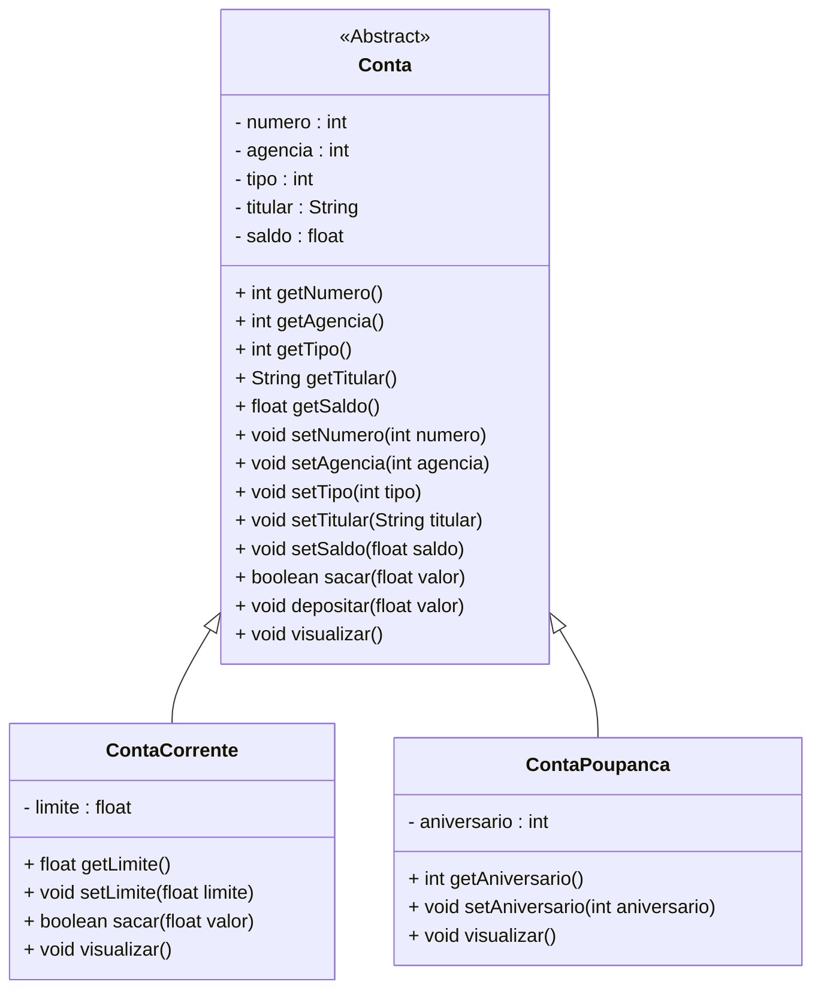

<h1>Classes Abstratas</h1>

As informações passadas neste documento norteia os conceitos da Oracle e podemos encontrar através deste link:

<div align="left"><a href="https://docs.oracle.com/javase/8/docs/api/">Oracle</a></div>

Relembrando nossa primeira sessão sobre Orientação a Objetos...

- Um programa escrito em Linguagem Orientada à Objetos representa uma parte do mundo real;
- As partes das quais o modelo é construído são objetos que aparecem no domínio do problema;
- Uma classe descreve de maneira **abstrata** todos os objetos de um tipo em particular.

> **Abstrato:** que não é concreto; que resulta da abstração, que opera unicamente com ideias, com associações de ideias, não diretamente com a realidade sensível, que possui alto grau de generalização. 

Em nosso Projeto Guia (Conta), Conta é uma Classe, entretanto observamos que quando definimos o conceito de **“uma Conta”**, estamos generalizando o conceito de uma Conta Bancária, sem definir maiores detalhes, apenas o que é comum para toda e qualquer conta. 

Quando definimos os conceitos de **Conta Corrente** e **Conta Poupança**, estamos definindo um tipo específico de conta, que terá as suas especificidades.

> **Especificidades:** Em nosso exemplo são as características que são exclusivas de cada tipo de conta. 

Nenhum banco possui uma conta genérica, toda e qualquer conta possui um propósito e especificidades, logo não será necessário criar um Objeto do tipo Conta, pois é uma definição muito genérica de Conta Bancária.

Para definirmos uma Classe Genérica, **que não necessita ser instanciada**, que servirá apenas como uma **Superclasse** para geração de outras Classes derivadas, implementaremos a Classe Conta como uma **Classe Abstrata**.

**Classes abstratas** são classes que não podem ser instanciadas, porém podem ser derivadas (herdadas). Geralmente são utilizadas apenas para permitir a derivação de novas classes. Identificamos uma Classe como Abstrata pelo modificador **abstract** na sua assinatura.

**Classe Concreta** é uma classe que pode ser instanciada.

<div align="center"></div>

Utilizamos Classes Abstratas porquê em uma hierarquia de classes, quanto mais alta a classe, mais abstrata é a sua definição. Uma classe no topo da hierarquia pode definir apenas o comportamento e os atributos que são comuns a todas as classes. Na maioria dos casos, a classe não precisa ser instanciada diretamente e cumpre apenas o papel de ser um repositório de comportamentos e atributos em comuns a todas as classes estendidas (herdadas).

<h3>Métodos Abstratos</h3>

A Classe Abstrata também pode ter em sua implementação **Métodos Abstratos**. Métodos abstratos são métodos sem código. Eles são prefixados pelo modificador **abstract**, não apresentam um corpo e sua declaração termina com “**;**” após a declaração dos parâmetros.

Um Método Abstrato indica que a classe não implementa aquele método e que ele deve ser obrigatoriamente implementado nas Classes derivadas, pois é um comportamento comum das subclasses. **Eles são utilizados somente em classes abstratas.**

**Sintaxe - Método Abstrato dentro da Classe Abstrata**

<div align="center"></div>

**Sintaxe - Subclasse (Classe estendida ou herdada)**

<div align="center"></div>

<br />

## 🔑**Pontos chave:**

1. **Classes Abstratas** são classes que não podem ser instanciadas, porém podem ser derivadas (herdadas). Geralmente são utilizadas apenas para permitir a derivação de novas classes. 
2. Identificamos uma Classe como Abstrata pelo modificador **abstract** na sua assinatura.
3. Abstract é um modificador sem acesso em Java que é aplicável para Classes, Interfaces e Métodos. 
4. Classe Abstrata representa uma classe incompleta, que depende de subclasses para sua implementação, ou seja, a criação de pelo menos uma subclasse é obrigatória para a classe abstrata. 
5. A Classe Abstrata também pode ter em sua implementação **Métodos Abstratos**. 
6. **Métodos abstratos** são métodos sem código. Eles são prefixados pelo modificador **abstract**, não apresentam um corpo e sua declaração termina com “**;**” após a declaração dos parâmetros.
7. Métodos Abstratos **são utilizados somente em classes abstratas.**

<br />

------

<h1>Projeto Conta Bancária</h1>

Na etapa anterior, implementamos as Classes Model **ContaCorrente** e **ContaPoupanca** como **Heranças da Classe Conta**. 

Nesta etapa, vamos transformar a Classe Conta em uma Classe Abstrata. O Diagrama de Classes do nosso Projeto ficará da seguinte forma:



<br />

<h2>👣 Passo 01 - Implementar a Classe Conta como Classe Abstrata</h2>

1. Abra a Classe Conta;
2. Adicione o modificador **abstract** na assinatura da Classe Conta;
3. O código completo da Classe Conta, você confere abaixo:

```java
package conta.model;

public abstract class Conta {
    
    private int numero;
	private int agencia;
	private int tipo;
	private String titular;
	private float saldo;

	public Conta(int numero, int agencia, int tipo, String titular, float saldo) {
		this.numero = numero;
		this.agencia = agencia;
		this.tipo = tipo;
		this.titular = titular;
		this.saldo = saldo;
	}

	public int getNumero() {
		return numero;
	}

	public void setNumero(int numero) {
		this.numero = numero;
	}

	public int getAgencia() {
		return agencia;
	}

	public void setAgencia(int agencia) {
		this.agencia = agencia;
	}

	public int getTipo() {
		return tipo;
	}

	public void setTipo(int tipo) {
		this.tipo = tipo;
	}

	public String getTitular() {
		return titular;
	}

	public void setTitular(String titular) {
		this.titular = titular;
	}

	public float getSaldo() {
		return saldo;
	}

	public void setSaldo(float saldo) {
		this.saldo = saldo;
	}

	public boolean sacar(float valor) {
		
		if(this.getSaldo() < valor) {
			System.out.println("Saldo Insuficiente!");
			return false;
		}
		
		this.setSaldo(this.getSaldo() - valor);
		return true;
		
	}
	
	public void depositar(float valor) {
		this.setSaldo(this.getSaldo() + valor);
	}
	
	public void visualizar() {

		String tipo = "";
		
		switch(this.tipo) {
		case 1:
			tipo = "Conta Corrente";
		break;
		case 2:
			tipo = "Conta Poupança";
		break;
		}
		
		System.out.println("\n\n***********************************************************");
		System.out.println("Dados da Conta:");
		System.out.println("***********************************************************");
		System.out.println("Numero da Conta: " + this.numero);
		System.out.println("Agência: " + this.agencia);
		System.out.println("Tipo da Conta: " + tipo);
		System.out.println("Titular: " + this.titular);
		System.out.println("Saldo: " + this.saldo);
	}
    
}

```

Observe que a única alteração implementada na Classe Conta foi a adição do modificador abstract na assinatura da Classe.

<br />

<h2>👣 Passo 02 - Remover os Objetos da Classe Conta da Classe Menu</h2>

Como a Classe Conta se tornou uma Classe Abstrata, não é possível instanciar Objetos desta Classe. Remova os Objetos criados para teste da Classe Menu.

1. Abra a Classe Menu;
2. Apague todos os Objetos da Classe Conta, que foram criados para teste;
3. O código completo da Classe Menu, você confere abaixo:

```java
package conta;

import java.util.Scanner;

import conta.model.ContaCorrente;
import conta.model.ContaPoupanca;
import conta.util.Cores;

public class Menu {

	public static Scanner leia = new Scanner(System.in);
	
	public static void main(String[] args) {

		int opcao;

		// Teste da Classe Conta Corrente
		ContaCorrente cc1 = new ContaCorrente(1, 123, 1, "José da Silva", 0.0f, 1000.0f);
		cc1.visualizar();
		cc1.sacar(12000.0f);
		cc1.visualizar();
		cc1.depositar(5000.0f);
		cc1.visualizar();
		
        // Teste da Classe Conta Poupança
		ContaPoupanca cp1 = new ContaPoupanca(2, 123, 2, "Maria dos Santos", 100000.0f, 15);
		cp1.visualizar();
        cp1.sacar(1000.0f);
		cp1.visualizar();
		cp1.depositar(5000.0f);
		cp1.visualizar();
		
		while (true) {
			
			System.out.println(Cores.TEXT_YELLOW + Cores.ANSI_BLACK_BACKGROUND + "*****************************************************");
			System.out.println("                                                     ");
			System.out.println("                BANCO DO BRAZIL COM Z                ");
			System.out.println("                                                     ");
			System.out.println("*****************************************************");
			System.out.println("                                                     ");
			System.out.println("            1 - Criar Conta                          ");
			System.out.println("            2 - Listar todas as Contas               ");
			System.out.println("            3 - Buscar Conta por Numero              ");
			System.out.println("            4 - Atualizar Dados da Conta             ");
			System.out.println("            5 - Apagar Conta                         ");
			System.out.println("            6 - Sacar                                ");
			System.out.println("            7 - Depositar                            ");
			System.out.println("            8 - Transferir valores entre Contas      ");
			System.out.println("            9 - Sair                                 ");
			System.out.println("                                                     "); 
			System.out.println("*****************************************************");
			System.out.println("Entre com a opção desejada:                          ");
			System.out.println("                                                     ");
			opcao = leia.nextInt();
			
			if(opcao == 9) {
				System.out.println("\nBanco do Brazil com Z - O seu futuro começa aqui!");
				leia.close();
				System.exit(0);
			}
			
			switch(opcao) {
			case 1:
				System.out.println("\n Criar Conta");
				
                 break;
			case 2:
				System.out.println("\n Listar todas as Contas");
				
                 break;
			case 3:
				System.out.println("\n Buscar Conta por número");
				
				break;
			case 4:
				System.out.println("\n Atualizar dados da Conta");
				
                 break;
			case 5:
				System.out.println("\n Apagar Conta");
				
                 break;
			case 6:
				System.out.println("\n Sacar");
				
				break;
             case 7:
				System.out.println("\n Depositar");
				
				break;
             case 8:
				System.out.println("\n Transferir");
				
				break;
			default:
				System.out.println("\nOpção Inválida");
                 break;
			}
        }
	}

}
```

<br /><br />

<div align="left"><a href="README.md">Voltar</a></div>