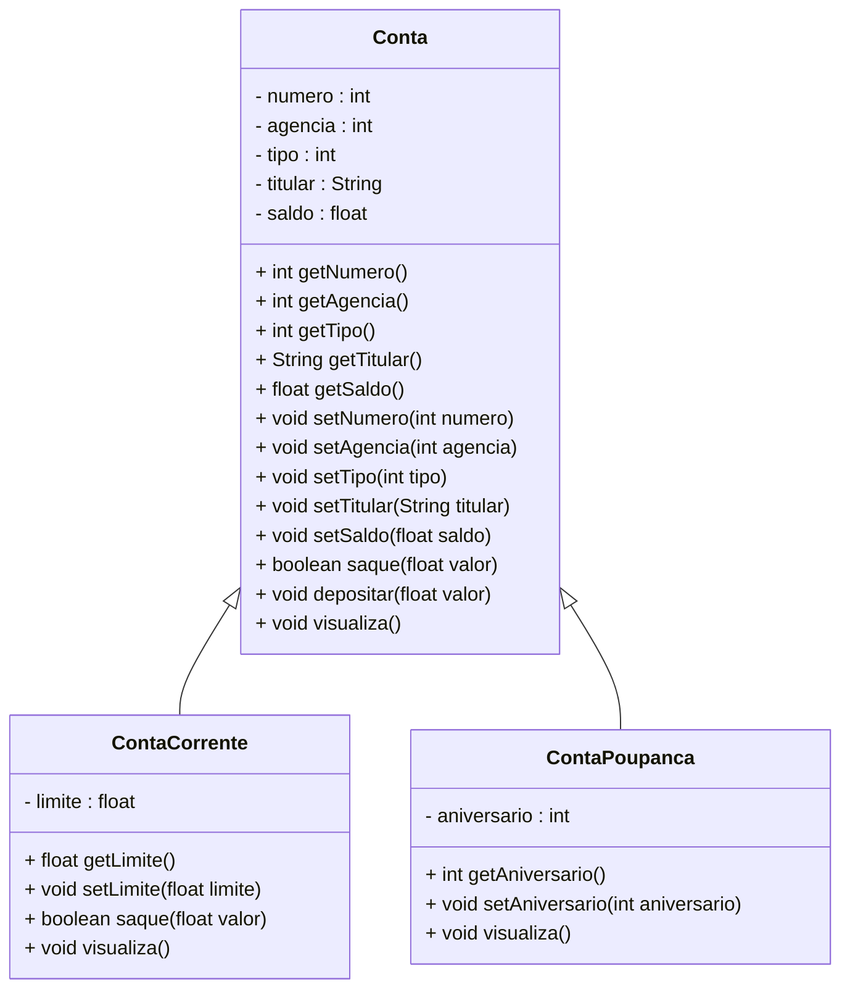

```mermaid
classDiagram
class Conta {
  - numero : int
  - agencia : int
  - tipo : int
  - titular : String
  - saldo : float
  + int getNumero()
  + int getAgencia()
  + int getTipo()
  + String getTitular()
  + float getSaldo()
  + void setNumero(int numero)
  + void setAgencia(int agencia)
  + void setTipo(int tipo)
  + void setTitular(String titular)
  + void setSaldo(float saldo)
  + boolean saque(float valor)
  + void depositar(float valor)
  + void visualiza()
}
class ContaCorrente {
  - limite : float
  + float getLimite()
  + void setLimite(float limite)
  + boolean saque(float valor)
  + void visualiza()
}
class ContaPoupanca {
  - aniversario : int
  + int getAniversario()
  + void setAniversario(int aniversario)
  + void visualiza()
}
Conta <|-- ContaCorrente
Conta <|-- ContaPoupanca
```
